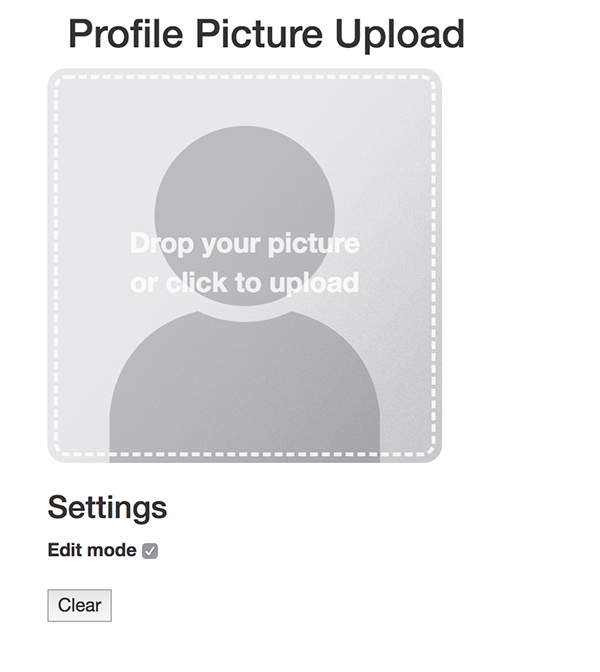

# Angular Profile Picture Upload Example

This is a small example on how to use the ng2-file-upload module to add a profile image with drag and drop capability.

* Angular 4
* ng2-file-upload
* File upload through drag and drop
* File upload through click and file selector

This example is *not fully working* without a service that stores images. This service is not included. The code is meant
to be taken as a reference and built upon.

## Screenshots

## Development server

Run `ng serve` for a dev server. Navigate to `http://localhost:4200/`. The app will automatically reload if you change any of the source files.

## Build

Run `ng build` to build the project. The build artifacts will be stored in the `dist/` directory. Use the `-prod` flag for a production build.

